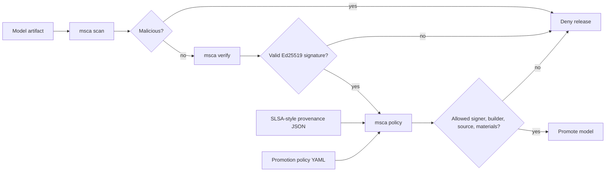

# Model Promotion Policy Gate

This repository implements a local model-release gate that verifies a model artifact before it is loaded or promoted:

1. Static scan detects executable pickle payloads and unsafe SafeTensors metadata.
2. Ed25519 verification proves the artifact hash was signed by an allowed signer.
3. SLSA-style provenance binds the artifact hash to a trusted builder, source repo, source ref, run ID, and required materials.
4. YAML policy makes the promotion decision reproducible in CI.



## Commands

```bash
msca scan model.pt --format sarif --output model.sarif
msca sign model.pt --signer training-pipeline-v1 --output model.sig
msca attest model.pt \
  --builder-id github-actions://poojakira/model-release \
  --source-repo https://github.com/poojakira/Model-Supply-Chain-Auditor \
  --source-ref refs/heads/main \
  --run-id "$GITHUB_RUN_ID" \
  --material training-data=data/train.csv \
  --output model.provenance.json
msca policy model.pt \
  --signature model.sig \
  --key model.pub \
  --provenance model.provenance.json \
  --policy docs/policy.example.yaml
```

## Deny Conditions

| Control | Denies when |
|---|---|
| Signature | Artifact hash changed, wrong public key, malformed signature |
| Signer | Signature identity is not in `allowed_signers` |
| Builder | Provenance builder ID is not in `allowed_builders` |
| Source | Source repository or ref is outside policy |
| Age | Provenance `finishedOn` exceeds `max_provenance_age_seconds` |
| Materials | Required training/eval material names are absent |

## Boundary

This gate does not prove model behavior is safe. It proves artifact integrity and release provenance before deserialization or deployment. Backdoors in legitimately trained weights require separate behavioral, data-lineage, and adversarial evaluation.
